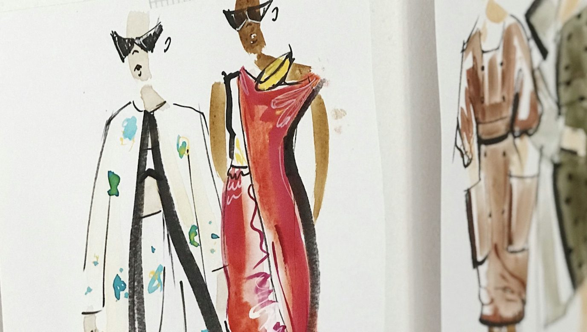
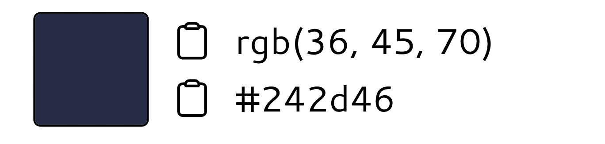

Photo by <a href="https://unsplash.com/@charlotablunarova?utm_content=creditCopyText&utm_medium=referral&utm_source=unsplash">Charlota Blunarova</a> on <a href="https://unsplash.com/photos/woman-painting-r5xHI_H44aM?utm_content=creditCopyText&utm_medium=referral&utm_source=unsplash">Unsplash</a>
  

# **AI/ML-driven Fashion Recommendation System**
## **Objective**

The goal of this project is to develop an AI/ML-driven Fashion Recommendation System that revolutionizes the online shopping experiences by providing personalized styling guidance and improving the accuracy of product search systems used by major e-commerce stores like Macy's or Nordstorm. The project aims to accomplish the following objectives:

* **Personalized Styling Guidance**
    * Build an intelligent system that acts as a virtual fashion stylist, offering personalized outfit recommendations to users based on their individual preferences, style, body type, and occasion.
    * Utilize advanced ML algorithms to analyze user data, including clothing items, accessories, style profiles, fashion trends, and user feedback, to generate tailored styling suggestions.
    * Incorporate image recognition, color analysis, style compatibility, and fashion trend forecasting to ensure visually appealing and fashionable outfit recommendations that align with the users' unique style preferences.

* **Enhanced Product Search Accuracy**
    * Develop AI/ML models that enhance search algorithms, ensuring more precise and relevant search results for users, even when dealing with complex queries or ambiguous search terms.
    * Explore advanced techniques such as image recognition and semantic search to improve search relevance, product categorization, and attribute extraction.
    * Continuously refine and optimize the search algorithms using user feedback, behavior analysis, purchase history, and real-time fashion trends to provide an increasingly tailored and accurate shopping experience.

## **Methodologies**

### **Semantics-based Product Search**

The first methodology applied for this project focuses on implementing a semantics-based product search system to improve the accuracy and relevance of search results. Through data preprocessing, semantic embeddings for each product description stored in the DB are generated using advanced NLP techniques. These embeddings capture the meaning and context of product descriptions. 

To perform a product search, a user query or a reference product description is also converted into a vector representation using the same text embedding technique. This query vector is then compared with all of product description vectors stored in the vector store. By measuring the similarity between vectors, typically L2 distance, the most similar product vectors are identified.

Compared to traditional tag or keyword matching methods, semantics-based product search offers several benefits:
* Deeper understanding of the product description compared to simple keyword matching.
* Flexibility in handling various languages, synonyms, and related terms, allowing for more flexible and comprehensive search capabilities.
* Optimized algorithms for high-performance retrieval, making the search process faster.
* More accurate and relevant search results lead to increased satisfaction and engagement.


For example:

```
from product_search import ProductSearcher

searcher = ProductSearcher("jeans.csv")
searcher.semantics_based_searcher(query="high-rise straight jeans", k=3)

# k stands for the number of similar products you want to pull out from the product store.
=========================================================================
# Example output:
1619 products indexed, each product description is represented by a 768-dimensional vector.
Similarity score: 26.24447250366211
brand                                                 Calvin Klein Jeans
product_description                         High-Rise Straight-Leg Jeans
original_price                                                    $79.50
image_src              https://slimages.macysassets.com/is/image/MCY/...
Name: 10, dtype: object
=========================================================================

Similarity score: 26.24447250366211
brand                                                       And Now This
product_description                         High-Rise Straight-Leg Jeans
original_price                                                    $49.00
image_src              https://slimages.macysassets.com/is/image/MCY/...
Name: 81, dtype: object
=========================================================================

Similarity score: 31.84622573852539
brand                                                Lauren Ralph Lauren
product_description                       High-Rise Straight Ankle Jeans
original_price                                                   $115.00
image_src              https://slimages.macysassets.com/is/image/MCY/...
Name: 886, dtype: object
=========================================================================
```

  

The pretrained model used for generating embeddings in this example is `bert-base-nli-mean-tokens`. For more detailed information on this model or to explore other pretrained models, you can refer to the [SentenceTransformers](https://www.sbert.net/) documentation.

### **Color-based Product Search**

In addition to the semantics-based product search methodology discussed in the previous section, incorporating color information can further enhance the accuracy and relevance of search results. By considering the dominant color of a product image, we can provide more visually similar product recommendations to users.

#### **Extracting Dominant Color**

To extract the dominant color from an image, we leverage the [colorthief](https://pypi.org/project/colorthief/) library. However, it's important to note that the result returned by colorthief may not always be stable, especially when the object in the image occupies a small area, and the background color is mistakenly identified as the dominant color. To address this issue, we introduce a secondary color as an alternative whenever the identified dominant color is very close to the background color.

Example usage:
```
from color_extractor import ColorExtractor
ColorExtractor("jeans/f59aa940-4138-495f-b269-749c48980605.jpeg").get_dominant_color()

#Output:
(53, 83, 123)
```

#### **Calculating Color Difference with CIELAB**

When searching for the most similar colors given a reference color, we utilize the delta formula defined by [CIELAB](https://en.wikipedia.org/wiki/CIELAB_color_space#:~:text=The%20CIELAB%20color%20space%2C%20also,%2C%20green%2C%20blue%20and%20yellow.) (`delta_E_CIE1994`) to calculate the color difference. This formula takes into account the perceptual differences between colors and provides a more reliable measure compared to simple Euclidean distance. Python library [colormath](https://github.com/gtaylor/python-colormath.git) provides guidelines over the usage of various difference calculation formulas.

Example usage:
```
$ git clone https://github.com/gtaylor/python-colormath.git
$ cd python-colormath
```

```
# Similar color search
from colormath.color_diff import delta_e_cie1994
from colormath.color_objects import LabColor, sRGBColor
from colormath.color_conversions import convert_color

def color_similarity(reference_color, sample_color):
    """
    Return the similarity score between two RGB colors.
    """
    # Convert RGB colors to Lab colors
    color1_lab = convert_color(sRGBColor(*reference_color), LabColor)
    color2_lab = convert_color(sRGBColor(*sample_color), LabColor)
    
    return delta_e_cie1994(color1_lab, color2_lab)
```

#### **Implement Color-based Search Only**

```
from product_search import ProductSearcher

# Search for 3 products where the colors are similar to (36, 45, 70)
ProductSearcher("jeans.csv").color_based_searcher(reference_color=(36,45,70), k=3)
```
Query color:



Example output:
```
Similarity score: 0.0
https://slimages.macysassets.com/is/image/MCY/products/0/optimized/26498420_fpx.tif?$browse$&wid=1200&fmt=jpeg
============================================================
Similarity score: 7.199332819041628
https://slimages.macysassets.com/is/image/MCY/products/8/optimized/23643478_fpx.tif?$browse$&wid=1200&fmt=jpeg
============================================================
Similarity score: 8.406546727039906
https://slimages.macysassets.com/is/image/MCY/products/5/optimized/22462345_fpx.tif?$browse$&wid=1200&fmt=jpeg
======================================
```
  

### **Color Theory**

Color theory is a concept that deals with how colors interact and relate to each other. It provides a framework for understanding the visual impact of different color combinations and how they can create certain moods or effects. In the context of fashion, color theory is used to create harmonious and visually appealing outfits.

When building an algorithm to help people find outfits in harmony, color theory can be applied in several ways:

* **Color matching**: the algorithm can analyze the colors present in an individual's wardrobe or a specific garment and suggest other items or accessories that would complement or match those colors. It can take into account color harmonius such as complementary colors or analogous colors to create visually pleasing combinations.
* **Color contrast**: the algorithm can help users understand how different colors interact with each other in terms of contrast. It can suggest color combinations that have a high contrast, such as pairing a dark color with a light color, or low contrast, such as combining similar shades of a color. By considering the level of contrast, the algorithm can guide users towards creating outfits with a balanced visual impact.
* **Color psychology**: different colors evoke different emotions and moods. The algorithm can take this into account and suggest colors that align with a user's desired mood of the occasion they are dressing for. For example, it might suggest calming and soothing colors for relaxed outfit or vibrant and energetic colors for a lively event.
* **Seasonal palettes**: fashion trends often revolve around seasonal color palettes. The algorithm can analyze current fashion trends and suggest outfits based on the colors that are popular for a particular season. This helps users stay up-to-date with the latest fashion trends and ensures that their outfits are in harmony with the current season.
* **Personalized recommendations**: the algorithm can take into account an individual's skin tone, hair color, and eye color when suggesting color combinations. Certain colors may complement a person's features more effectively, and the algorithm can provide personalized recommendations based on these factors.

Example 1: Pairing the sweater below with a pair of jeans with complementary colors.


Candidates with different saturation and lightness:


