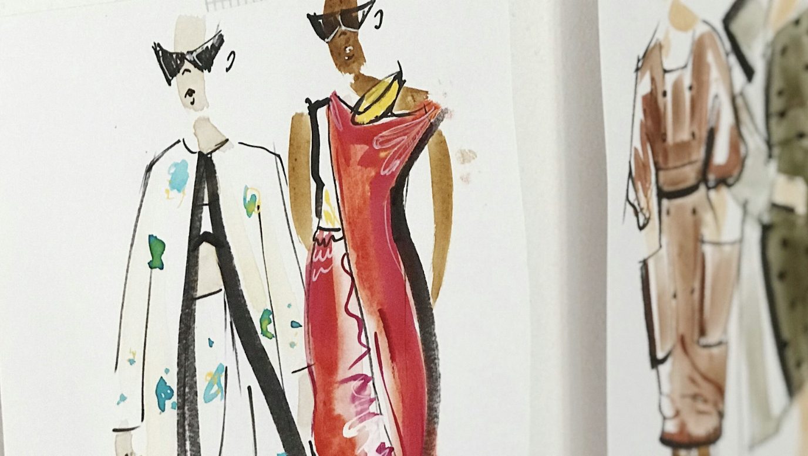

# **AI/ML-driven Fashion Recommendation System**



## **Objective**

The goal of this project is to develop an AI/ML-driven Fashion Recommendation System that revolutionizes the online shopping experiences by providing personalized styling guidance and improving the accuracy of product search systems used by major e-commerce stores like Macy's or Nordstorm. The project aims to accomplish the following objectives:

* **Personalized Styling Guidance**
    * Build an intelligent system that acts as a virtual fashion stylist, offering personalized outfit recommendations to users based on their individual preferences, style, body type, and occasion.
    * Utilize advanced ML algorithms to analyze user data, including clothing items, accessories, style profiles, fashion trends, and user feedback, to generate tailored styling suggestions.
    * Incorporate image recognition, color analysis, style compatibility, and fashion trend forecasting to ensure visually appealing and fashionable outfit recommendations that align with the users' unique style preferences.

* **Enhanced Product Search Accuracy**
    * Develop AI/ML models that enhance search algorithms, ensuring more precise and relevant search results for users, even when dealing with complex queries or ambiguous search terms.
    * Explore advanced techniques such as image recognition and semantic search to improve search relevance, product categorization, and attribute extraction.
    * Continuously refine and optimize the search algorithms using user feedback, behavior analysis, purchase history, and real-time fashion trends to provide an increasingly tailored and accurate shopping experience.

## **Methodologies**

### **Semantics-based Product Search**

The first methodology applied for this project focuses on implementing a semantics-based product search system to improve the accuracy and relevance of search results. Through data preprocessing, semantic embeddings for each product description stored in the DB are generated using advanced NLP techniques. These embeddings capture the meaning and context of product descriptions. 

To perform a product search, a user query or a reference product description is also converted into a vector representation using the same text embedding technique. This query vector is then compared with all of product description vectors stored in the vector store. By measuring the similarity between vectors, typically L2 distance, the most similar product vectors are identified.

Compared to traditional tag or keyword matching methods, semantics-based product search offers several benefits:
* Deeper understanding of the product description compared to simple keyword matching.
* Flexibility in handling various languages, synonyms, and related terms, allowing for more flexible and comprehensive search capabilities.
* Optimized algorithms for high-performance retrieval, making the search process faster.
* More accurate and relevant search results lead to increased satisfaction and engagement.


For example:

```
from product_search import ProductSearcher

searcher = ProductSearcher("jeans.csv")
searcher.semantics_based_searcher(query="high-rise straight jeans", k=3)

# k stands for the number of similar products you want to pull out from the product store.
=========================================================================
# Example output:
1619 products indexed, each product description is represented by a 768-dimensional vector.
Similarity score: 26.24447250366211
brand                                                 Calvin Klein Jeans
product_description                         High-Rise Straight-Leg Jeans
original_price                                                    $79.50
image_src              https://slimages.macysassets.com/is/image/MCY/...
Name: 10, dtype: object
=========================================================================

Similarity score: 26.24447250366211
brand                                                       And Now This
product_description                         High-Rise Straight-Leg Jeans
original_price                                                    $49.00
image_src              https://slimages.macysassets.com/is/image/MCY/...
Name: 81, dtype: object
=========================================================================

Similarity score: 31.84622573852539
brand                                                Lauren Ralph Lauren
product_description                       High-Rise Straight Ankle Jeans
original_price                                                   $115.00
image_src              https://slimages.macysassets.com/is/image/MCY/...
Name: 886, dtype: object
=========================================================================
```

  

The pretrained model used for generating embeddings in this example is `bert-base-nli-mean-tokens`. For more detailed information on this model or to explore other pretrained models, you can refer to the [SentenceTransformers](https://www.sbert.net/) documentation.
